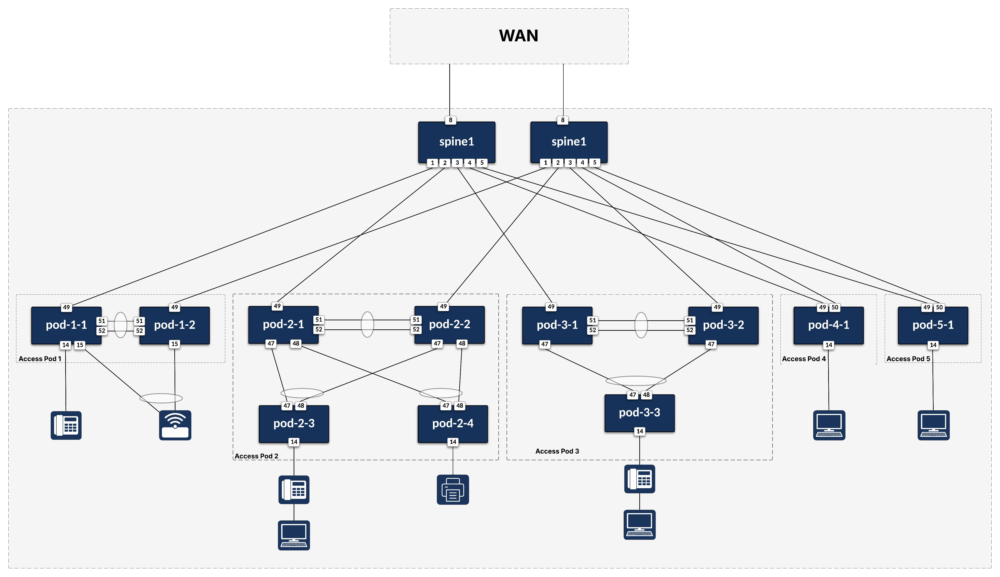
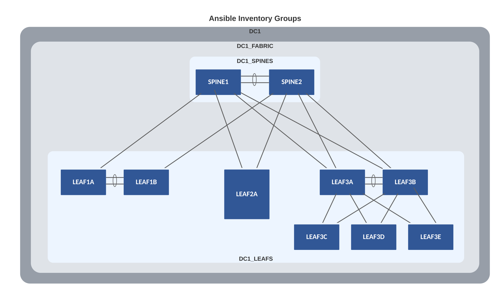
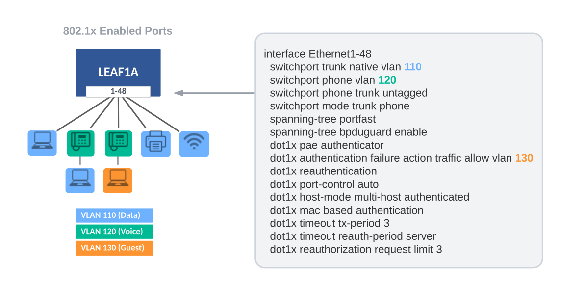

# Example for Campus Fabric

## Introduction

This example describes and includes all the AVD files used to build a Campus Fabric by building upon the previous [L2LS Fabric](../../examples/campus-fabric/README.md) example. The spine nodes provide L3 routing of SVIs, and the L2 leaf nodes support 802.1x Network Access Control (NAC) with port ranges.

## Installation & Requirements

1. Install AVD - Installation guide found [here](../../docs/installation/collection-installation.md).
2. Install Ansible module requirements - Instructions found [here](../../docs/installation/collection-installation.md).
3. Run the following playbook to copy the Getting Started examples to your working directory.

``` bash
# current working directory: ~/ansible-avd-examples
ansible-playbook arista.avd.install_examples
```

## Design Overview

### Physical Campus Fabric Topology

In a Campus network, it is common to refer to the location of the switches as **MDF** (Main Distribution Frame) and **IDFs** (Independent Distribution Frame). Throughout this example, we refer to the spine nodes as the MDF and the leaf nodes as the IDFs. This example shows various switch types and common ways of cabling the IDF to the MDF.

- MDF
  - Two Spine nodes
- IDFs
  - POD1 supporting 96 users with two leafs (1RU - 48 ports each)
  - POD2 supporting 192 users with 4 leafs (1RU - 48 ports each)
  - POD3 supporting 144 users with 3 leafs (1RU - 48 ports each)
  - POD4 supporting 48 users with 1 leaf (1RU - 48 ports each)
  - POD5 supporting 48 users with 1 leaf (1RU - 48 ports each)

The drawing below shows the physical topology used in this example. The interface assignment shown here are referenced across the entire example, so keep that in mind if this example must be adapted to a different topology.



## Basic EOS Switch Configuration

Basic connectivity between the Ansible controller host and the switches must be established before Ansible can be used to deploy configurations. The following should be configured on all switches:

- Switch Hostname
- IP enabled interface
- Username and Password defined
- Management eAPI enabled


    The management interfaces used by cEOS and vEOS, are `Management0` and `Management1`, respectively. When using actual hardware switches, `Management1` is used. The included basic switch configurations may need to be adjusted for your environment.

Below is the basic configuration file for SPINE1:

``` shell
!
no aaa root
!
username admin privilege 15 role network-admin secret sha512 $6$E4w14C31asEyKhVE$wJc8N0Ao02.ExYCJqjK.fNyq/QXfSMM.eaoRRNAXBzhTEFsO0CMDhTtUCQMm/lg.kDh5U8u74n782N7RwTNXa/
!
transceiver qsfp default-mode 4x10G
!
service routing protocols model multi-agent
!
hostname SPINE1
!
spanning-tree mode mstp
!
management api http-commands
   no shutdown
!
management api gnmi
   transport grpc default
!
management api netconf
   transport ssh default
!
interface Management0
   ip address 172.16.100.101/24
!
no ip routing
!
ip route 0.0.0.0/0 172.16.100.1
!
```

## Ansible Inventory

Now that we understand the physical L2LS topology, we must create the Ansible inventory that represents this topology. The following is a textual and graphical representation of the Ansible inventory group variables and naming scheme used in this example:

``` text
- DC1
  - DC1_FABRIC
    - DC1_SPINES
    - DC1_LEAFS
  - DC1_NETWORK_SERVICES
    - DC1_SPINES
    - DC1_LEAFS
  - DC1_NETWORK_PORTS
    - DC1_SPINES
    - DC1_LEAFS
```

DC1 represents the highest level within the hierarchy. Ansible variables defined at this level will be applied to all nodes in the fabric. Ansible groups have parent-and-child relationships. For example, both DC1_SPINES and DC1_LEAFS are children of DC1_FABRIC. Groups of Groups are possible and allow variables to be shared at any level within the hierarchy. For example, DC1_NETWORK_SERVICES is a group with two other groups defined as children: DC1_SPINES and DC1_LEAFS. The same applies to the group named DC1_NETWORK_PORTS. You will see these groups listed at the bottom of the inventory file.

This naming convention makes it possible to extend anything quickly and can be changed based on your preferences. The names of all groups and hosts must be unique.



### inventory.yml

The below inventory file represents two spines and ten leafs. The nodes are defined under the groups DC1_SPINES and DC1_LEAFS, respectively. We apply group variables (group_vars) to these groups to define their functionality and configurations.

The hostnames specified in the inventory must exist either in DNS or in the hosts file on your Ansible host to allow successful name lookup and be able to reach the switches directly. A successful ping from the Ansible host to each inventory host verifies name resolution (e.g., ping SPINE1).

If DNS is unavailable, define the variable ansible_host as an IP address for each device.

``` yaml
--8<--
examples/campus-fabric/inventory.yml
--8<--
```


## Build Fabric Topology

AVD Fabric Input Variables

To apply AVD input variables to the nodes in the fabric, we make use of Ansible group_vars. How and where you define the variables is your choice. The group_vars table below is one example of AVD fabric variables.

| group_vars/              | Description                                   |
| ------------------------ | --------------------------------------------- |
| DC1.yml                  | Global settings for all devices               |
| DC1_FABRIC.yml           | Fabric, Topology, and Device settings         |
| DC1_SPINES.yml           | Device type for Spines                        |
| DC1_LEAFS.yml            | Device type for Leafs                         |
| DC1_NETWORK_SERVICES.yml | VLANs/SVIs                                    |
| DC1_NETWORK_PORTS.yml    | Port Profiles and Network Port Ranges         |

The tabs below show the Ansible **group_vars** used in this example.


## Network Services

The Network Services data model is stored in the **DC1_NETWORK_SERVICES** group_var tab above. Each IDF will have three unique VLANs to support Data, Voice, and Guest networks. The spine nodes will provide routing for these VLANs via locally assigned SVIs.

### VLAN/IP Subnet Assignment

| IDF  | Data                 | Voice                 | Guest                 |
| ---- | -------------------- | --------------------- | --------------------- |
| IDF1 | 110 - (10.1.10.0/23) | 120 - (10.1.20.0/23)  | 130 - (10.1.30.0/23)  |
| IDF2 | 210 - (10.2.10.0/23) | 220 - (10.2.20.0/23)  | 230 - (10.2.30.0/23)  |
| IDF3 | 310 - (10.3.10.0/23) | 320 - (10.3.20.0/23)  | 330 - (10.3.30.0/23)  |

## Port Profiles and Network Ports

AVD provides a way to standardize and reuse port profiles through a compact data model you can utilize across the network. The Network Ports data model is stored in the **DC1_NETWORK_PORTS** group_vars tab above. Each port is configured to support NAC and dynamically assigns the proper VLAN based on 802.1x authentication. Multiple device types (IP Phones, Workstations, Printers, Access Points, etc.) can share the same port configuration below.



The above sample port configuration is easily produced with `port_profiles` and `network_ports` data models. Each port has similar configuration items defined in `port_profiles`, while `network_ports` defines which switches and port ranges are to be applied. The `network_ports` data model allows regex to match switches and an `expand_range` filter to cover a range of ports. For details, see the documentation for [`port_profiles`](../../roles/eos_designs/docs/input-variables.md#port-profiles-settings) and [`network_ports`](../../roles/eos_designs/docs/input-variables.md#network-ports-settings).

## WAN/Core Edge

Lastly, we need to provide a way for traffic to exit the Campus Fabric via the WAN/Core Edge. This is easily accomplished using `underlay_routing_protocol` and `core_interfaces` to create point-to-point IP links to the WAN/Core and enable a routing protocol such as OSPF. This simple data model below is located at the bottom of the **group_vars/DC1_FABRIC.yml** file.

``` yaml
# Underlay Routing Protocol
underlay_routing_protocol: ospf

#### WAN/Core Edge Links ####
core_interfaces:
  p2p_links:
    - ip: [ 10.0.0.3/31, 10.0.0.2/31 ]
      nodes: [ SPINE1, WAN ]
      interfaces: [ Ethernet52/1, Ethernet1/1 ]
      include_in_underlay_protocol: true
    - ip: [ 10.0.0.5/31, 10.0.0.4/31 ]
      nodes: [ SPINE2, WAN ]
      interfaces: [ Ethernet52/1, Ethernet1/1 ]
      include_in_underlay_protocol: true
```

## Deploy Fabric

### The Playbooks

Now that we have defined all of our Ansible variables (AVD inputs), it is time to generate some configurations. To make things simple, we provide two playbooks. One playbook will allow you to build and view EOS CLI intended configurations per device. The second playbook has an additional task to deploy the configurations to your switches. The playbooks are provided in the tabs below. The playbook is straightforward as it imports two AVD roles: `eos_designs` and `eos_cli_config_gen`, which do all the heavy lifting. Combining these two roles produces recommended configurations that follow Arista Design Guides.

=== "build.yml"

    ``` yaml
    --8<--
    examples/campus-fabric/build.yml
    --8<--
    ```

=== "deploy.yml"

    ``` yaml
    --8<--
    examples/campus-fabric/deploy.yml
    --8<--
    ```

### Playbook Run

To build the configuration files, run the playbook called `build.yml`.

``` bash
### Build configurations
ansible-playbook build.yml
```

After the playbook run finishes, EOS CLI intended configuration files were written to `intended/configs`.

To build and deploy the configurations to your switches, run the playbook called `deploy.yml`. This assumes that your Ansible host has access and authentication rights to the switches. In this example, we defined the authentication variables in the `DC1_FABRIC.yml` file.

``` bash
### Build configurations & Push Configs to switches
ansible-playbook deploy.yml
```

### EOS Intended Configurations

Your configuration files should be similar to these.

=== "SPINE1"

    ``` shell
    --8<--
    examples/campus-fabric/intended/configs/SPINE1.cfg
    --8<--
    ```

=== "SPINE2"

    ``` shell
    --8<--
    examples/campus-fabric/intended/configs/SPINE2.cfg
    --8<--
    ```

=== "LEAF1A"

    ``` shell
    --8<--
    examples/campus-fabric/intended/configs/LEAF1A.cfg
    --8<--
    ```

=== "LEAF1B"

    ``` shell
    --8<--
    examples/campus-fabric/intended/configs/LEAF1B.cfg
    --8<--
    ```

=== "LEAF2A"

    ``` shell
    --8<--
    examples/campus-fabric/intended/configs/LEAF2A.cfg
    --8<--
    ```

=== "LEAF3A"

    ``` shell
    --8<--
    examples/campus-fabric/intended/configs/LEAF3A.cfg
    --8<--
    ```

=== "LEAF3B"

    ``` shell
    --8<--
    examples/campus-fabric/intended/configs/LEAF3B.cfg
    --8<--
    ```

=== "LEAF3C"

    ``` shell
    --8<--
    examples/campus-fabric/intended/configs/LEAF3C.cfg
    --8<--
    ```

=== "LEAF3D"

    ``` shell
    --8<--
    examples/campus-fabric/intended/configs/LEAF3D.cfg
    --8<--
    ```

=== "LEAF3E"

    ``` shell
    --8<--
    examples/campus-fabric/intended/configs/LEAF3E.cfg
    --8<--
    ```

## Next steps

Modify this example and expand the features to match your Campus topology.
